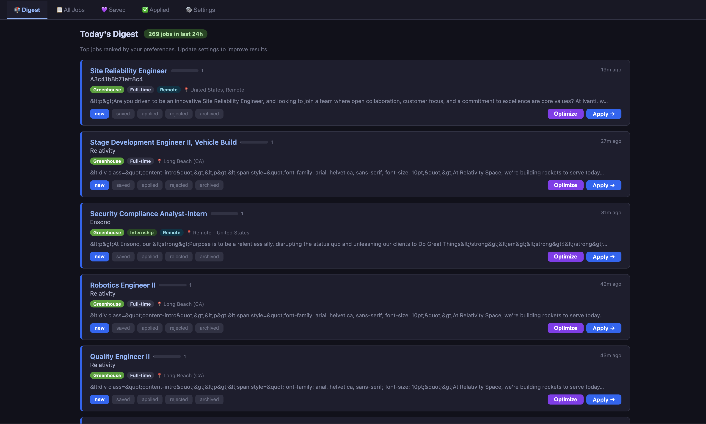
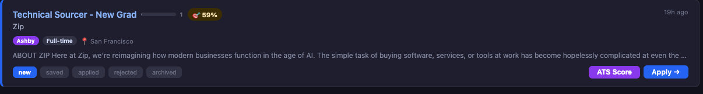
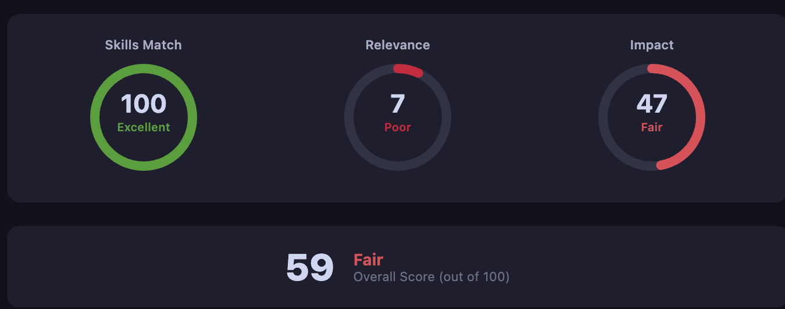
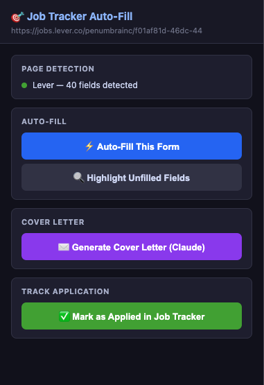

<div align="center">

# 🧠 Job Tracker — Automated Job Aggregator

**Scrape, filter, score, and track entry-level software engineering jobs across 200+ companies — all from one self-hosted dashboard.**

[](https://nodejs.org)
[](https://www.typescriptlang.org)
[](https://react.dev)
[](LICENSE)

</div>

---

## ✨ What It Does

Job Tracker automatically scrapes job postings from **Greenhouse, Lever, Ashby, Workday, SmartRecruiters, Workable,** and **JSearch** every 6 hours. It then:

- **Filters** for entry-level, junior, internship, and co-op software engineering roles
- **Scores** each posting against your custom keywords and company preferences
- **Lets you track** each job through a full pipeline — `new → saved → applied → rejected / archived`
- **Scores your resume** against a job description using a local ATS engine (no external API)
- **Auto-fills** job application forms and generates AI cover letters via a companion Chrome extension

---

## 📸 Screenshots

| Dashboard | ATS Resume Score |
|:---------:|:---------------:|
|  |  |

| Filter Bar | Chrome Extension |
|:----------:|:---------------:|
|  |  |

---

## 🛠️ Tech Stack

| Layer | Technologies |
|-------|-------------|
| **Backend** | Node.js 20, TypeScript 5, Fastify 5, better-sqlite3, node-cron |
| **Frontend** | React 19, Vite 7 |
| **Database** | SQLite (single file — zero configuration) |
| **AI / ML** | OpenAI API (cover letters & form fill), local TF-IDF resume scorer |
| **Notifications** | Web Push (VAPID) — daily job digest |
| **Browser Extension** | Chrome MV3 — auto-fill + Claude AI cover letter |

---

## 🚀 Quick Start

### Prerequisites

- **Node.js** 20 or later
- **npm** 9 or later

### 1 — Clone & Install

```bash
git clone https://github.com/priyabrataunt/job_automation.git
cd job_automation

# Install backend dependencies
cd backend && npm install

# Install frontend dependencies
cd ../frontend && npm install
```

### 2 — Configure Environment

```bash
cp backend/.env.example backend/.env
# Edit backend/.env — at minimum, no keys are required for basic scraping.
# Add OPENAI_API_KEY to enable AI cover letters.
# Add RAPIDAPI_KEY to enable the JSearch collector.
```

### 3 — Run

```bash
# Terminal 1 — Backend API (port 8000)
cd backend
npm run dev

# Terminal 2 — Frontend UI (port 3000)
cd frontend
npm run dev
```

The backend will start an immediate collection run on startup and then repeat every 6 hours automatically.

---

## ⚙️ Environment Variables

All variables live in `backend/.env`. Copy `backend/.env.example` to get started.

| Variable | Required | Description |
|----------|----------|-------------|
| `OPENAI_API_KEY` | For AI features | Powers AI cover letter generation and form auto-fill |
| `RAPIDAPI_KEY` | For JSearch | Enables the JSearch job source ([get a free key](https://rapidapi.com/letscrape-6bRBa3QguO5/api/jsearch)) |
| `VAPID_PUBLIC_KEY` | For push | Web Push public key (generate with `npx web-push generate-vapid-keys`) |
| `VAPID_PRIVATE_KEY` | For push | Web Push private key |
| `VAPID_SUBJECT` | For push | `mailto:` address used in VAPID headers |

---

## 🔌 API Reference

| Method | Endpoint | Description |
|--------|----------|-------------|
| `GET` | `/api/jobs` | List jobs — query params: `status`, `ats_source`, `job_type`, `remote`, `search`, `hours` |
| `PATCH` | `/api/jobs/:id/status` | Update a job's status |
| `GET` | `/api/stats` | Counts by status / source / type, plus last run info |
| `GET` | `/api/runs` | Last 10 collection run records |
| `POST` | `/api/collect?hours=24` | Trigger an immediate collection run |
| `GET` | `/api/collect/status` | `{ running: boolean }` |
| `GET` | `/health` | Health check |

---

## 🔍 Filtering Logic

A job is included only when **all three** conditions are met:

1. **Title** contains a software / ML / infra keyword (e.g., *software engineer*, *SDE*, *ML engineer*, *DevOps*)
2. **Seniority** — no senior / lead / principal / staff keywords in the title
3. **Location** — US-based or remote; international roles are excluded

Detected job types: `fulltime` · `internship` · `co-op`

---

## 📊 ATS Resume Scorer

The built-in resume scorer runs **entirely locally** (no external API calls) and evaluates four dimensions:

| Metric | Weight | Description |
|--------|--------|-------------|
| Skills Match | 40% | Required vs. preferred skills extracted from the JD |
| Relevance | 30% | TF-IDF–inspired term overlap between resume and JD |
| Visa Signal | 15% | Detects sponsorship-positive / sponsorship-negative language |
| Impact | 15% | JD-aligned action-theme comparison |

---

## 🧩 Chrome Extension

The companion extension auto-fills job application forms and generates tailored cover letters.

**Setup:**
1. Open Chrome → `chrome://extensions/`
2. Enable **Developer mode**
3. Click **Load unpacked** → select the `chrome-extension/` folder
4. Click the extension icon and configure your profile
5. In `profile.json`, set `job_tracker_url` if your backend is not running at `http://localhost:8000`

---

## 📅 Status Workflow

```
new  →  saved  →  applied  →  rejected
                           →  archived
```

---

## 🤝 Contributing

Pull requests are welcome. For major changes, please open an issue first.

1. Fork the repo
2. Create a feature branch (`git checkout -b feature/my-feature`)
3. Commit your changes (`git commit -m 'feat: add my feature'`)
4. Push to the branch (`git push origin feature/my-feature`)
5. Open a Pull Request

---

## 📄 License

This project is licensed under the [MIT License](LICENSE).
